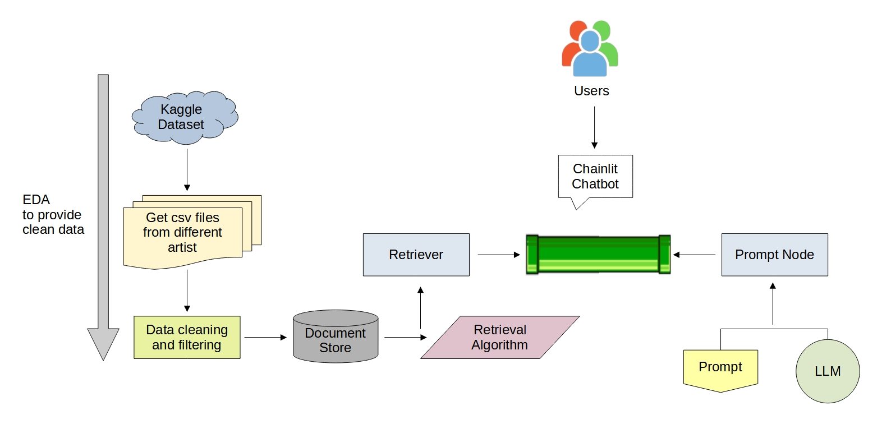

# Hacktoberfest 2023

<p align="center">
 
 <h2 align="center">Hacktoberfest 2023 Project</h2>
 <p align="center"><b>Haystack RAG pipeline for a chatbot.</b></p>

</p>
  <p align="center">
    <a href="https://github.com/cabustillo13/RAG_Haystack_Chatbot/actions/new">
      
    </a>
        <a href="https://github.com/cabustillo13/RAG_Haystack_Chatbot/issues">
      
    </a>
    <a href="https://github.com/cabustillo13/RAG_Haystack_Chatbot/pulls">
      
    </a>
    <br />
    <p align="center">
  </p>
</p>

## ⚙️ Set up
Install poetry.
```
pip install poetry
```

Install required packages using the following command:
```
poetry install
```

## 📍 Haystack RAG pipeline for a chatbot

We're building a Haystack RAG pipeline for a chatbot that answers questions about music lyrics.

For this project, we're using a subset of this Kaggle Dataset: [Song Lyrics](https://www.kaggle.com/datasets/deepshah16/song-lyrics-dataset).

We're using Haystack for Document Store and build the RAG pipeline and Open AI gpt3.5-turbo LLM to build a chatbot with Chainlit for song lyrics.

## 🙌 Haystack Pipeline



1. **Setting up the Document Store**
   - Initializing an InMemoryDocumentStore with BM25 retrieval capabilities.

2. **Data Retrieval**
   - Downloading the lyrics dataset from Kaggle.
   - Loading lyrics data for different artists into dataframes.
   - Merging the dataframes into a single dataframe.
   - Data preprocessing, including column renaming and conversion to the document store format.

3. **Prompt Template**
   - Defining a `rag_prompt` template for generating responses from music lyrics and user questions.

4. **Retriever Configuration**
   - Configuring a BM25Retriever to work with the document store for document retrieval based on user queries.

5. **GPT-3.5 Turbo Configuration**
   - Setting up a `PromptNode` to utilize the GPT-3.5 Turbo model for generating responses. This includes specifying your OpenAI API key and using the `rag_prompt` template.

6. **Pipeline Setup**
   - Creating a pipeline (`pipe`) with two nodes: the retriever and the GPT-3.5 Turbo model.

7. **Main Function**
   - Defining the core functionality of the project, where user queries are processed using the pipeline, and responses are sent back to the user.

This pipeline enables users to ask questions related to music lyrics, with answers generated by GPT-3.5 Turbo and retrieved documents from the document store.

## 😎 Team members

- Linkedin: [Monica Regina da Silva](https://www.linkedin.com/in/monicasil/), [Carlos Bustillo](https://www.linkedin.com/in/carlos-bustillo/)
- Github: [MonicaRSilva](https://github.com/MonicaRSilva),[cabustillo13](https://github.com/cabustillo13)
